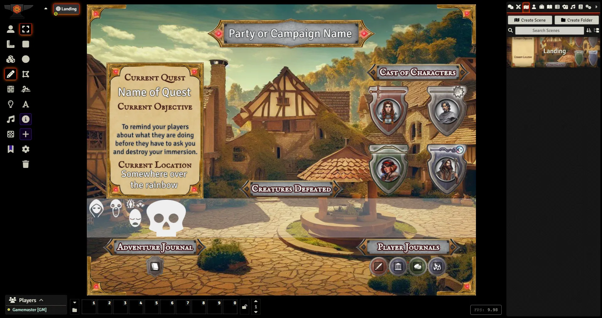

This is a dead-simple mod that provides a landing page designed with flexibility in mind.

It can be used for any game system, but currently has a medieval theme. I am considering creating additional versions for other eras, depending on interest. If you would like to request an additional theme, please open a bug on the github page.
  
This particular version supports 4 players. I am planning additional versions for 5 and 6 players. If you would like a version with another number of players, please open a bug on the github page.
## Art Credits
Foreground created with <a href="https://inkarnate.com/">Inkarnate</a> and made transparent with <a href="https://affinity.serif.com/en-us/designer/">Affinity Designer.</a>

Tiles and sample background created with <a href="https://www.bing.com/images/create?FORM=GENILP">Microsoft Bing Image Creator</a> and tokenized with Affinity Designer.

## Setup
- Export the two compendiums. One is the landing page scene, and the other is for the journals.
#### Scene Images
- The foreground and background are both 2000x1500 webps. It has a standard square grid, which is transparent.
- The background is the same size. It is currently just a black rectangle, but ideally, you should change it out for a setting-specific vignette.
- Crop your background image to 2000x1500 pixels in order to prevent Foundry from showing a warning every time the scene loads.
#### Title and Quest Boxes
- The text drawings in these boxes has the Drawing Role set to "information". This way, it is visible on the top layer. Just edit the text for each box.
#### Cast of Characters
- I recommend using tiles that point to the actor image, as shown in the examples. 
- To get them to align nicely inside the shields, do the following:
  - Drag your token or portrait image onto the scene with Asset Grid Size of 400 so they fit inside the grid square.
  - Set the image Elevation to above 20.
  - Set the Tile Scale to 1.5 for both Horizontal and Vertical. This will make them (seemingly) align to the center of the grid, rather than the corner, and to fit nicely inside the shield.
- If you decide use actors instead, you will need to set their elevation to above 20 for them to appear on the overlay.
#### Creatures Defeated
- I used this area to keep track of recent kills as sort of a milestone tracker. 
- To keep this module open for all systems, the sample Creatures are tiles pointing to images that came with Foundry. Delete them to get started.
- Since there is no foreground image, you can use regular actors here. Make sure you are using creatures from your compendium, rather than a module that you might uninstall at some point.
- Adjust the opacity of the creature box tile so the creatures contrast nicely with your background. On a bright background, it might need to be at least 50%. On a dark background, you might want to leave it where it is.
#### Adventure and Character Journals
- There is a folder with example journals, which are included in the scene.
- These folders have the players as owners, so you could actually give these to your players to use.

Enjoy!
## Art Credits
Foreground created with Inkarnate and made transparent with Affinity Designer.
Tiles created with HeroForge and tokenized with Affinity Designer.
