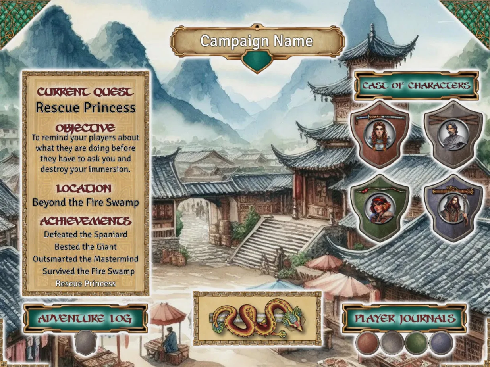
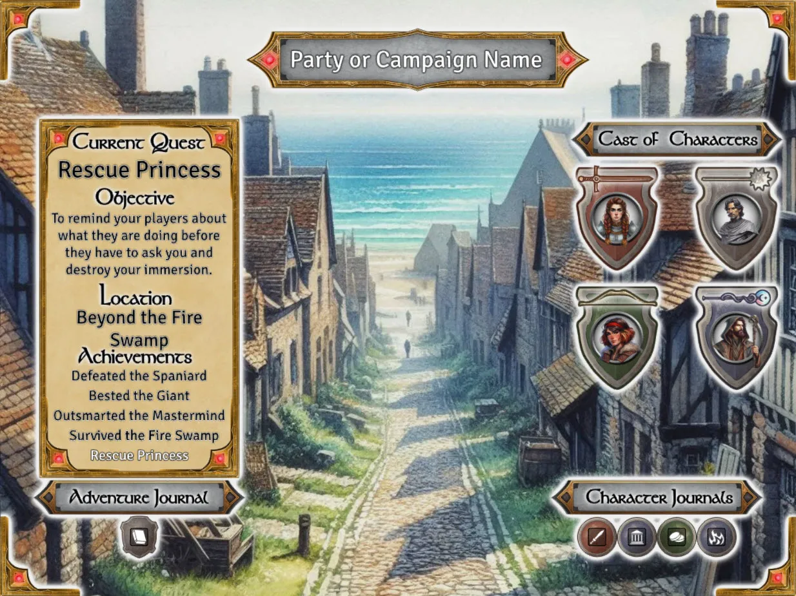

This is a dead-simple mod that provides a landing page designed with flexibility in mind. It consists of a scene with a foreground image, leaving you the flexibility to add any background you want, as shown in the example above.

It can be used for any game system, but currently has a medieval theme. I am considering creating additional versions for other eras, depending on interest. If you would like to request an additional theme, please open a bug on the github page.
  
This particular version supports 4 players. I am planning an additional version for 6 players. If you would like a version with another number of players, please open a bug on the github page.

## Setup
Export the two compendiums. One is the landing page scene, and the other is for the journals. The journals include more detailed instructions.

Enjoy!

## Art Credits
Foreground created with <a href="https://inkarnate.com/">Inkarnate</a> and made transparent with <a href="https://affinity.serif.com/en-us/designer/">Affinity Designer.</a>

Tiles and sample background created with <a href="https://www.bing.com/images/create?FORM=GENILP">Microsoft Bing Image Creator</a> and tokenized with Affinity Designer.

